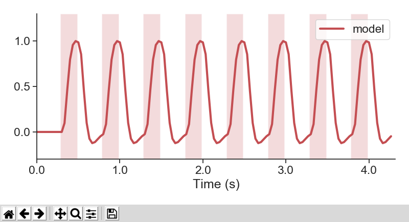
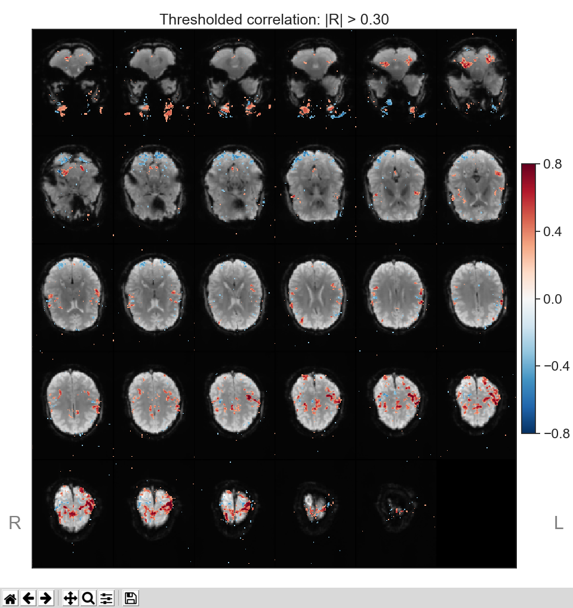
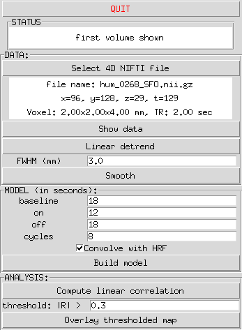

# PyRat_fMRI
## A python GUI app for quick fMRI analysis
**PyRat_fMRI** can get you from a 4D NIFTI file to an activation map in under 1 minute. It is meant for a quick inspection of activation maps, **NOT** for formal analysis.





The GUI is built with Tk (python's tkinter module).
It can perform the following functions:


1. Reading of 4D fMRI data in NIFTI format
2. Display of mean volume in mosaic layout
3. Linear detrending in time
4. Gaussian smoothing in space
5. Creation of block design regressors (including HRF convolution)
6. Computation and display of Pearson's correlation maps (with regressor)
7. Display of thresholded correlation maps

### Requirements
The app was written with python 3.7.3 on ubuntu 18.04 using the packages below:
1. numpy 1.16.4
2. scipy 1.3.0
3. matplotlib 3.1.0
4. seaborn 0.9.0
5. nibabel 2.5.0

### Download and run
```bash
git clone https://github.com/niksirbi/PyRat_fMRI.git
cd PyRat_fMRI
python PyRat_fMRI.py
```
